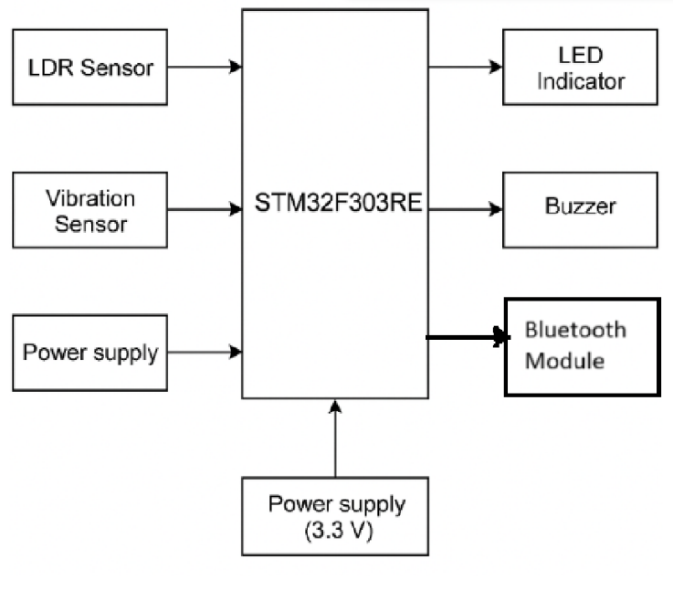

# Smart Helmet for Safety Monitoring using STM32
## Overview
This project implements a Smart Helmet system using the STM32F303RE
microcontroller to improve user safety in low-visibility and hazardous
environments.

The helmet automatically activates an LED in low-light conditions using
LDR-based sensing and detects sudden impacts using a vibration sensor.
An audible alert is triggered during collisions, and sensor data can be
transmitted wirelessly via Bluetooth.
## Features
- Automatic ambient light detection using ADC (LDR)
- LED headlamp auto-activation in low visibility
- Impact detection using SW-420 vibration sensor
- Buzzer alert on collision
- Bluetooth (HC-05) based wireless monitoring
- Real-time firmware using STM32 HAL
## Hardware Used
- STM32F303RE (ARM Cortex-M4)
- LDR sensor
- SW-420 vibration sensor
- HC-05 Bluetooth module
- LED and active buzzer

## Software & Tools
- STM32CubeIDE
- STM32 HAL Libraries
- Embedded C
## System Architecture

## Working Principle
- LDR voltage is sampled using STM32 ADC
- If light level falls below a threshold, LED is turned ON
- Vibration sensor triggers GPIO interrupt on impact
- Buzzer alerts nearby individuals
- Sensor data is sent via Bluetooth UART
## Future Improvements
- MEMS accelerometer for impact severity classification
- Battery Management System (BMS)
- GPS-based emergency alert system
